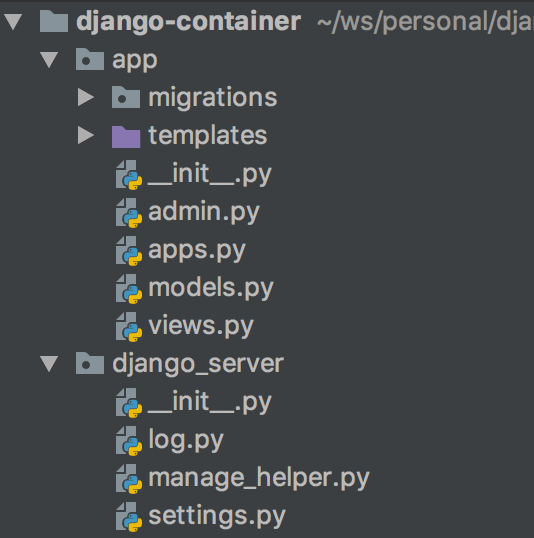
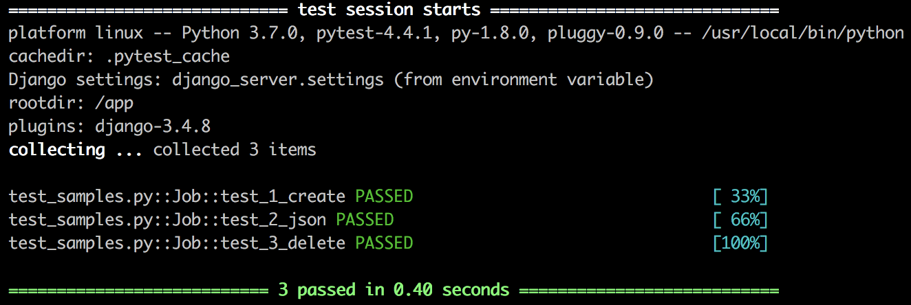
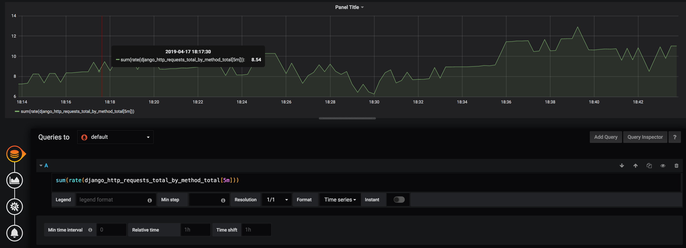

# Development tips and tricks
What can simplify your development?

## Reusable code
- Generic names `app`, `django_server`.
- Don't use **project name** in source code.
- Make your projects **as similar as possible**.
- Generic [Dockerfile](../Dockerfile).

## Smart tests
- Tests are documentation also.
- Run **one**, run **all**.
- Use mocking if you can.

## Easy to run
- Provide `Dockerfile` and `docker-compose.yml`.
- Provide `docker-compose.test.yml` for easy tests running.
- Simplify setup as possible (auto migration, auto create user).
- Lock your deps versions to run easily in future.

## Swagger
- Can be generated from source code (`django-rest-swagger`).
- Has also interactive UI for testing.

## Metrics
- Use exporting metrics using middleware.
- Create custom metrics if you need only.

