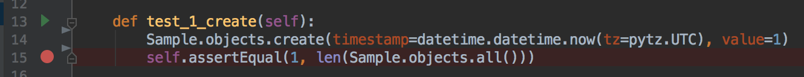

# Development tips and trics
What can simplify your development?

## Reusable code
- Generic names `app`, `django_server`.
- Make your projects **as similar as possible**.

## Smart tests
- Test are documentation also.
- Run **one**, run **all**.
- Use mocking if you can.

## Easy to run
- Provide `Dockerfile` and `docker-compose.yml`.
- Provide `docker-compose.test.yml` for easy tests running.

## Swagger
- Can be generated from source code.
- Has also interactive UI for testing.

